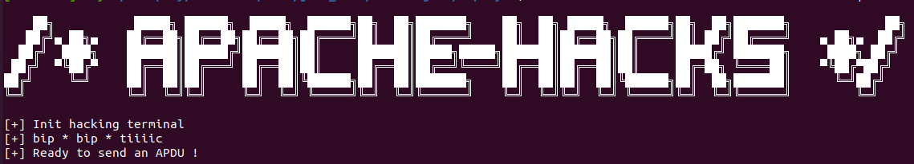

# Course hipPIN

## Description



You're looking to physically infiltrate the building that manages the submarine cables on the south coast of France. However, access is protected by a smart card reader.
From reliable sources, you know that a secret is embedded in these cards. You must find this secret at all costs!

Your pickpocketing skills have enabled you to steal an employee's access card.
However, this card is protected by a pin code.
There's got to be a way of finding this code to access the card's secret...

Using your pirate terminal, you can send commands of your choice to this card and observe its responses.
You find the source code of the Java Card applet that seems to be used.

> You can communicate with the Smart Card's terminal by using `netcat`.
> You can provide X hex buffers as parameters.
> If the port number associated to the docker is 65432, then type:
> ```
> $ echo "BUFFER1 BUFFER2 BUFFERX" | nc -N localhost 65432 
> ```
>
> You have access to the resource [src/java](./files/src.java).

## Content

- `deploy/`: files for the server
- `files/`: files for challengers
- `images/`: picture for description of this challenge
- `README.md`: this README

## Running the challenge locally

From this folder:
```
docker build -t course_hippin deploy/
docker run --rm -d -p 65432:65432 course_hippin
```
