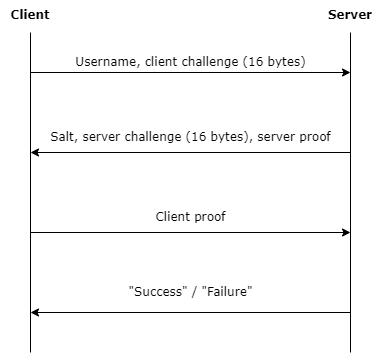

# Authentifiction - Write-up

This is a write-up for the challenge [Authentifiction](../Authentifiction/).

## Challenge

This challenge is a home-made authentication protocol and is highly insecure.
A valid authentication allows the retrieval of a file associated to the user.

When you connect to the server for user *SugarColts* with the script `client.py`, we retrieve a document that lists users of a malevolant association.

```
User name: SugarColts
Password: 
Welcome SugarColts
Get file [y/N]? y
=============================================
Classified User Directory: Operation Blackout
=============================================

List of existing users and their role.
Only our leader knows the full plan.

-------------
AbyssOverlord
-------------
    Real Identity: Unknown
    Specialization: Strategic planning, cyber warfare coordination,
        and advanced AI integration
    Recent Operations: Masterminded several high-profile cyber attacks on global
        financial institutions and government networks
    Current Assignment: Overseeing the execution of Operation Blackout, ensuring
        seamless coordination among all operatives
```

The leader's name seems to be *AbyssOverlord* and he knows the *full plan*.

It appears that the goal of the challenge is to authenticate as this user to get a secret document (that includes the flag).

## Protocol overview

Reading the script and/or the communication with the server, the authentication protocol steps are given in the following diagram.



Client and server proofs are calculated using a shared secret:
a symmetric key derived from the user's password.
The server does not store the password, only the secret key.
Each can verify the proof of the other peer for mutual authentication.

The basic idea of the protocol is that one peer encrypts the other peer's random challenge using this symmetric key.
A correct proof is used to authenticate the user or the server.

## Details

The server proof is calculated as the encryption of the following payload:

```
client challenge (16 bytes) || username || "server"
```

The client proof is calculated as the encryption of the following payload:

```
server challenge (16 bytes) || username || \"client\"
```

The encryption algorithm is AES in CTS (ciphertext stealing) mode.

Let $K$ the secret key associated to user *AbyssOverlord* and
$E_{K}(block)$ the encryption of one block with the secret key.

Then, the payload is constituted of three blocks:

- $P_{1} = {\rm CC}$ (client challenge, similarly, server challenge will be named $\rm CS$)
- $P_{2} = {\tt AbyssOverlordser}$ (the username and the first letters of "server" to fill the 16-bytes block)
- $P_{3} = {\tt ver}$ (the end of the word "server")

The encryption in CTS mode can be described through the use of CBC mode:
- $C_1 = E_K({\rm IV} \oplus P_1)$
- $C^\prime_2 = E_K\left( C_1 \oplus P_2 \right)$
- $C^\prime_3 = E_K\left( C^\prime_2 \oplus \left( P_3\ {\rm padded\ with\ zero\ bytes} \right) \right)$

Then, the penultimate block is truncated, and the last two blocks
swapped:
- $C_2 = C^\prime_3$
- $C_3 = C^\prime_2$ truncated to the first three bytes

Steps are reversed for decryption:
- $C_2$ is decrypted to obtain $C^\prime_2 \oplus (P_3\ {\rm padded\ with\ zero\ bytes})$
- Since $C_3$ is three bytes long, then the last 13 bytes of the previously decrypted block are taken to complete $C_3$ and form the full block $C^\prime_2$
- Finally, the blocks $(C_1, C^\prime_2, C^\prime_3)$ can be     decrypted with CBC mode.

## Bypass the authentication

Without knowning the password, the only possibility is to modify the server proof into a valid client proof.
The script `client.py` indicates that the username might not be verified by the server.
What remains is to forge a proof that verifies the following two points once it is decrypted:
- The first block is the client challenge
- The last 6 bytes forms the word "client"

The main modifications of the server proof to achieve that are:
- Manipulation of the IV to change the client challenge into the server challenge
- Manipulation of the last blocks so that the decryption payload ends with "client" instead of "server".

Supposong the client challenge is composed only of zero bytes, then a
forged proof can be constructed as follows:
- ${\rm IV}_{\rm new} = {\rm IV} \oplus {\rm CS}$
- ${C_1}_{\rm new} = C_1$
- ${C_2}_{\rm new} = C_1$
- ${C_3}_{\rm new} = ({\rm IV\ truncated\ to\ the\ first\ six\ bytes}) \oplus {\rm "client"}$

When the server decrypts this proof (we note $D_{K}(block)$ the
decryption of one block):
- First block: $D_K\left( {C_1}_{\rm new} \right) \oplus {\rm IV}_{\rm new} = {\rm CS}$
- Last block:
  - Decryption of penultimate block: $D_{K}({C_2}_{\rm new}) = {\rm IV}$
  - Since ${C_{3}}_{new}$ is 6 bytes long, the last 10 bytes of previously decrypted block (those are the last bytes of the original $\rm IV$) are taken to complete ${C_3}_{\rm new}$ to form a full block which is:
  ${\rm IV} \oplus ({\rm "client"\ padded\ with\ zero\ bytes})$
  - This block is XORed with the decryption of ${C_2}_{\rm new}$ and we get "client" padded with zero bytes
  - Since ${C_3}_{\rm new}$ is 6 bytes long, only the first 6 bytes are taken: "client".

This is a valid proof, since the server does not validate the username that is expected between the server challenge and the suffix "client".

## Flag

The following script executes those steps, then we are authenticated as
*AbyssOverlord* and the secret document with the flag is retrieved.

```python
#!/usr/bin/env python3

import socket
import json

def xor(a: bytes, b: bytes):
    return bytes([x ^ y for x, y in zip(a, b)])

try:
    s = socket.socket(socket.AF_INET, socket.SOCK_STREAM)
    s.connect(("localhost", 5000))

    # 1. Send auth_init request
    request = {
        "option": "auth_init",
        "user_name": "AbyssOverlord",
        "client_challenge": "00000000000000000000000000000000"
    }
    s.sendall(json.dumps(request).encode() + b'\n')

    # 2. Get server proof and server challenge
    data = s.recv(1024)
    response = json.loads(data.decode())
    server_proof = bytes.fromhex(response["server_proof"])
    server_challenge = bytes.fromhex(response["server_challenge"])

    # 3. Modify server proof into a client proof
    iv = server_proof[:16]
    c1 = server_proof[16:32]
    c2 = server_proof[32:48]

    new_iv = xor(iv, server_challenge)
    new_c1 = c1
    new_c2 = c1
    new_c3 = xor(iv[:6], b"client")
    client_proof = new_iv + new_c1 + new_c2 + new_c3

    # 4. Send auth_proof
    request = {
        "option": "auth_proof",
        "client_proof": client_proof.hex()
    }
    s.sendall(json.dumps(request).encode() + b'\n')

    # 5. Request file
    data = s.recv(1024)
    request = {"option": "get_file"}
    s.sendall(json.dumps(request).encode() + b'\n')

    file_content = b""
    while True:
        data = s.recv(1024)
        file_content += data
        if len(data) < 1024:
            break

    print(file_content.decode())

except Exception as e:
    print(e)

finally:
    s.close()
```