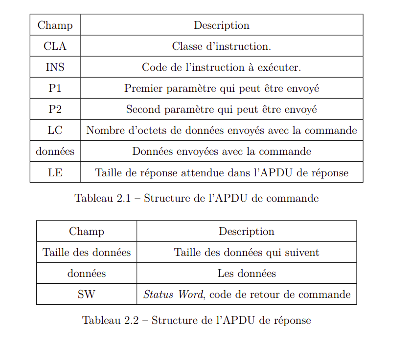

# Course hipPIN - Write-up

This is a write-up for the challenge [Course hipPIN](../Course_hipPIN/).

The objective here is to retrieve the secret flag embedded in the smart card.
To achieve this, one must authenticate on this card and then extract the secret data.
The first difficulty is to understand how the main communication buffer (APDU) is structured in order to send command to the card.

The comment on the top of the source code explains that the code is "Heavily protected thanks to an OwnerPin class, so nothing bad can happen".
It gives an information that the OwnerPin class does not come from the official Java Card API, but rather from a home made class.
This class aims at handling PIN codes, retry counter and so on.
So the PIN code has to be valid!
The check if performed in this method:

```java
private void verify(APDU apdu) {
    byte[] buffer = apdu.getBuffer();
    // retrieve the PIN data for validation.
    if (pin.check(buffer, ISO7816.OFFSET_CDATA, SECRET_PIN_SIZE) == false) {
        ISOException.throwIt(SW_VERIFICATION_FAILED);
    }
}
```

The call to `pin.check()` has to return true.

The user may read some documentation about the communication with a Java Card.
It has to respect the APDU command format. The [APDU is divided in different fields](https://en.wikipedia.org/wiki/Smart_card_application_protocol_data_unit).



The `CLA`, the `INS`, the INStruction parameters P1 and P2 and some data.
After some researches both on internet and the source code, the user might be able to determine that the values expected by the code to call `verify()` are:

- `CLA` set to `0x80`,
- `INS` set to `0x20`,
- `P1` and `P2` to any 1 byte value each
- `Nc` here is the size of the pin code of `0x06` (to guess)
- `Nc` bytes of data corresponding to the PIN code `0x090305050108`

The user has to guess to correct length and PIN code.
Because the smart card protects a building, the possible value for a PIN byte is between 0x00 and 0x09 as you can see on a regulard key pad.
This drastically reduces the possible number of PIN codes to try.
By trying some guesses, if both the length `Nc` is correct and the first byte of the PIN code is valid, then a huge delay is added by the card (simulating its processing!).
Then, each correct guessed byte adds extra delay until the whole PIN code is retrieved.
This is a timing attack.

Once the user is authenticated by providing the correct PIN code, he has to retrieve the secret data.
From the source code, we know that the total size of the FLAG is `0x0E49`.
The APDU has to be constructed based on this value.
The call to get the data is `getFlag()` so the `INS` byte has to be `0x50`.
Finally, the APDU buffer has to be:

- `CLA` is unchanged to `0x80`
- `INS` is set to `0x50`
- `P1` and `P2` to any 1 byte value each
- `Nc` is `0x00`
- `Le`, the data length expected has to be 2 bytes: `0x0E49`.

As a result, the card responds with the whole data buffer.
One has to decode it to binary.
Then the file is detected as a picture.
It contains the Flag !
