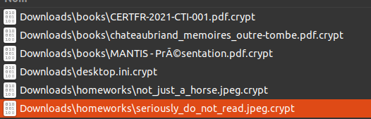
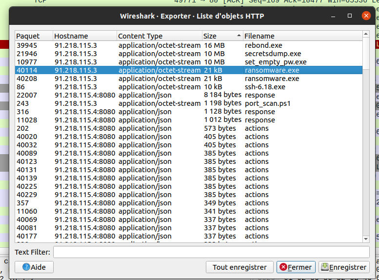
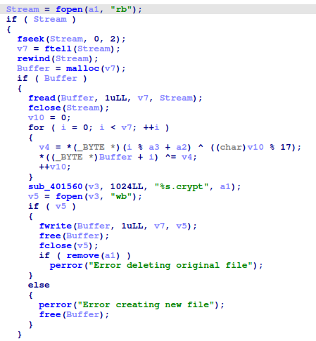
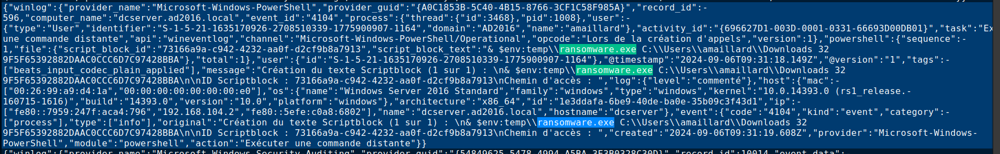

# Mantis operation - Write-up

This is a write-up for the challenge **Mantis operation**.

The objective of this challenge is to forensic different kind of data (pcaps, reverse, logs, machine artifacts) of a network.
By reading the challenge's description, the challenger should guess that a ransomware was deployed on a machine, and the data where ciphered.
By looking at the forensic archive, we can see a suspicious file.
We should decipher it.
The user has to retrieve the ransomware's binary.

He can get the ransomware's binary by extracting in from one of the pcap files.
Basically, the file is downloaded in plain HTTP on a machine before being launched.
This operation is possible directly in Wireshark.
Maybe the user will encounter different other binaries used by the attacker but they won't help to retrieve the original file.

To prevent a too "easy to analyse" binary, debug information are
stripped from it. IDA should be enough to understand how the binary
works. The decompiling feature is available on the free version of IDA,
and helps a lot to understand the code. Lucky us, the attacker loves
clean code and he has separated his code in functions, the ciphering one
included.

Some hardening where made to prevent all attacks resulting from a basic
xor ciphering. The user shall now understand that the key is not
embedded in the code, but it might be given by launching the ransomware
from the command line.

The logs folder is a help to retrieve such arguments. Two options are
now available to him. Either he can code the decipher function in
another language to decipher the file later, or, he can directly use
again the ransomware with the correct arguments on a Windows machine. In
both cases the user has to retrieve the key.

By exploring the logs folder, the user shall see some logs about the
ransomware. Fortunately for the network, the "Powershell Transcript" are
enabled. As a result, the plain command line triggering the ransomware
including the key are logged here. The original document can easily be
accessed by using the key to decipher the original documents.

La clé est donc de 32 octets, et est 0x9F5F65392882DAAC0CCC6D7C97428BBA
