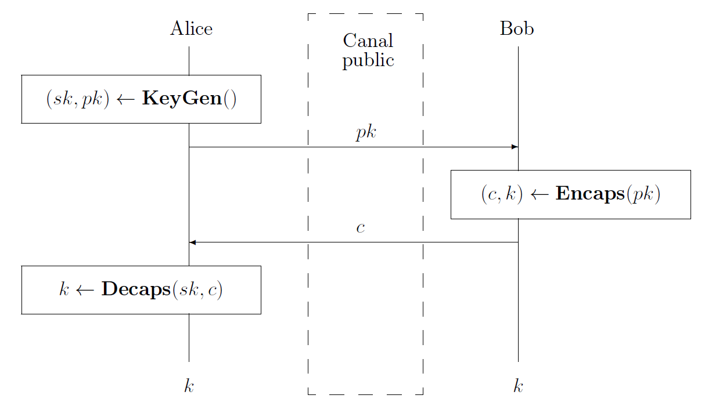
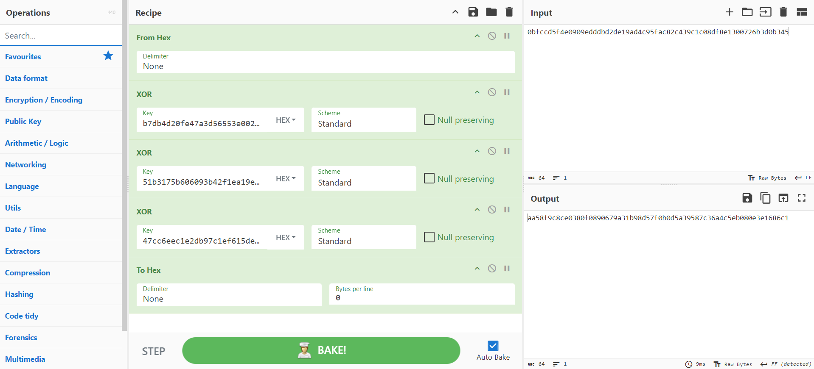

# Qwantik -- Write-up

This is a write-up for the challenge [Qwantik](../Qwantik/).

## Overview of the challenge

In this challenge, you have an intercepted key exchange communication.
The aim is to find the shared session key. You know that the session key is exchanged using a hybrid mechanism combining RSA-1024 and Kyber-512.
The combiner used is not explicitly mentioned, but the title of the challenge and the article [Why you should not put all your eggs in the same basket, part 3]([https://www.amossys.fr/insights/blog-technique/why-you-should-not-put-all-your-eggs-in-the-same-basket-part-3]) suggests that it's the XOR combiner.
As a reminder, a key exchange takes place between two parties as follows:

1.  Alice generates a hybrid private-public key pair, keeps the
    private one $sk$ and sends the public one $pk$ to Bob.

2.  From the public key $pk$, Bob execution the encapsulation function
    and obtains a ciphertext $c$ and a key $k$. He keeps the key $k$ and
    sends the ciphertext $c$ to Alice.

3.  Alice decapsulates the ciphertext $c$ with her private key $sk$ to
    obtain the key $k$ herself.



At the end of the key exchange, Alice and Bob share the same session key $k$.
An explanation of a hybrid key exchange with the XOR combiner is available in the link given above.

In addition, you have in your possession a decapsulation oracle.
This tool lets you recover the session key from a new and valid hybrid ciphertext, i.e., a ciphertext not yet sent publicly or requested to the decapsulation oracle.

## Data recovery

The first step in this challenge is to recover the public data exchanged between A and B in hexadecimal with command 5.
A sends B an RSA public key concatenated with a Kyber public key.
B replies to A with an RSA ciphertext concatenated with a Kyber ciphertext.
Here's an example of data.

Menu, and command chosen by the user:
```
[DEBUG]: Warning, XOR combiner is unsafe. Consider using a safer key encapsulation mechanism combiners.

Please choose an action:
 1- Encapsulation with RSA
 2- Encapsulation with Kyber
 3- Decapsulation Oracle
 4- Test a session key
 5- Read the latest communication

Command:
5
```

Results from the command:
```
(Beginning of communication between A and B)
(A --> B: pk_rsa + pk_kyber)
8512ccb09d19702cbf05d1c3e89131b5be8a39ab58da29a06a7b07e9e62ff209e9db4ecd8628b5df21234b2e6840f214a14fc77573fc15b398c18d68038302f14d050949cd3338fe5e9de1e41b9578ba88ace791d294354ea96b2d5f16b5cde288655b4bf55d5ef34117a981bde24d1b7d79174c8b50357d82e6aa444d1c29fd010001daf876761c108ae70dd90991982aaadaf12e4631c7518579151c1f739506d27152972256f09158626b1b7e56a7a532856c665c53accfe9575720603ea982ac212857d804c777c9227bbc9ec461599c308ee69723ebc5754fd110a01ba3e836cd2f6a3e01c673d1b2cc5696ab3cc223b9f7385b4808b6da1ef9274c4f505c14408b9ed69c1aec7087b26f8d0b1c700ac4cfa44b54c035060861e242b5d4b70e1598c3f0e65e83a90732ccb634aa392dfc4fccf5101513ae50cab35e113d81505bff69c976982c882a6bc8a1c85d9a8b93fcc5638786e3499fede5a7c686314f5b9734ebc318475f3674a7ab61acfa11b5c4395abf516848085d408420f370a9cec916d60bb0bdb45ebe7c0d1653a0bb860212159618b92f29fc3895e8933c77203cec2e699b90f33b8774a441710a8aeae966914668669885379060180aa334a0b3e8f554fca44ae5c6a260d65d9625237878a57c030b3eb672f4e5a1d87852ad3965e23864af71328a4cc43b3c24c48c63343aa779a799e69c10d52c94915998c604524dc48d3a688675b49e5c625a8e7758fd1a7669bc0ab0d45b4f859ac3a88e6b595064e7a66f843789d008ace5a1a22b7fbdc5a45d81a2691403d1b55fc23ac7fe92c8f1e250823723007a0dd2f79ef38acafca751217b9430a6bfec1561f7457dd82a983804a4f4179ee4a3aadc40cfae72165e6727dcc03118e4266798349c187270a380d0734580b7b3993a050d62574c602c373319c52573317b1a29e4c77fe7537d644c37b01a0d61a2fbe09342ea65f74a29baf7976e1a5d208a4b0504266ce572532b860375136986108a2bb6cc884bf3273ec45a5cdbd8c17a35c46d15a535c3bd63366fa1873a46522e43f7407da626f427c7cd42adfbca1730819fa20365f3b8b01125abf7730bc261c02a60cd06213a6a9a34e688c3fb8b1c02acb4c6d6590c962d621c40661bc447ab6f3f674011d189300111a7024a9a3803547341c1974ff456acf3d751fc3084338136f06180253bb367d8957e4cb7b3c8cb1c735277d03f0d00951a26c5a34264c4a3c06506b86dd6788310589e6202b2c2a3b34929e18ac00aaf9ce13aff86a76c69b1e0d013ee40518a9456d3f0c6

(B --> A: c_rsa + c_kyber)
188646fa0f516e55ee6175c83f5641471d78cc20475c955328f304f02f489cce25366ea7a5cf5db033f0bfce442d347acef6d53fa689a196c70555cbdce3e298bcf671182e44b43aeea434e8041058e7f0a75581fd10a1c7d212a668bccebf77efae80a3b5ee54bcab2d04f2b2d4e49d6e1ee4f7410367d2d0d5e2733cc1d3fbb2b6f27a6faefdc4ef9865cb1d7609d0d0008fc5b1b703630a589104d2e131704991fb8fb6157e5c7d7f7326a56452893afe765a6b54f4b07d8d5f6670970b45911d4254024311da9cdbe08a694d68e3128b20dbbf0fde5ff3904bd2b8ad88430338f0cb6a09483bbeda8a292f900edc8f959d3d7ac704ef23203385dcfce55d3411f20c0858a4de15366b5e63e05f231a0707a2dbade6462efa4fc9e314d3e954e03d911a3e59522efb4dec93565a3cf628018df798f44900547205f0dc02ffa4f917c801fa8f43495f3eda869bc9d58de0c198610d61e09a01eee8ce90a8488f4a47941dd1e47b4fa81e82e1a379304dec3d2b74c2a60b0caffde83c2c9d8f8ff6dbd3668c24350c476325fe95151553326b383c2bc558dfd17d9b0dd59fad871f86101b544608fac43f6f5667f47e12869c4c62c1466a0f44cf9266cc85a7adf492e885e969f3becb72f79e226ffce54dbb03bfca012ce6fd68f17c9ef2125866f146ed4f679aa61765d0dbc714ff784cdfd77af562e87a4a8af6d0109841101a7c6079b7874f38514ce9f53bdfb69f7446c8684a214919d9a28957ff063425763a8f705909d155b09d1b84eddd438708ee9a59aa980f8b36d301fd1875e69591b7c78cf52f6baf8509f416e41f8689f48bef1783a38795cb167980c5f0d8869298e5cf9f95f0a8a445e56b380e046452f63417412d70cc0ce7d5338c33e9f922a0970a7ca014f11a25a6d3db4680b07aa6fc8ab9e7391999a1e44e5002069dabff0a64707e5ec87834e66ee0de3591afb415ba500361e1a3d61f6b8fa3023475484a00a6dfec3e39ad94de6222d5e13e9f4fd9165166c60937ebf906480493cbac98aa6999be9c08c3a9d29182ac00b267e74e015df189a1c3cdbf08142539b6f4da4301ceaeafd2ea8ed6dd6a65e8fe553ca6fdd941aeddaf53f6cd30b586b7def0afd40ce42716bae2a89def3abd57e7dcfa700a545286472608ae74ec83729b274b1157323246795c1ac2129d6ecae8bc76ed2dd0fa7145fc576b2a1ed946a04ca7a7c369f3f391cdb5b9c35ebdfbcdd0b0dfe6780056986a9c3d04ce
```

Now we need to distinguish between the RSA public key $pk_{\rm RSA}$ and the Kyber public key $pk_{\rm Kyber}$.
The same applies to the encrypted keys.
The concatenated public key consists of 1862 hexadecimal characters.
A quick Internet research reveals that the size of the Kyber 512 public key is 800 bytes, i.e., 1600 hexadecimal characters.
This means that $1862/2-800=131$ bytes remain for the RSA public key:
128 bytes for the modulus and 3 for the public exponent; this is consistent.
We can do the same with the ciphertext:
the first 128 bytes are those of the RSA ciphertext $c_{\rm RSA}$ and the next 768 bytes those of the Kyber ciphertext $c_{\rm Kyber}$.
Note that $c_{\rm RSA}$ encapsulates a key $k_{\rm RSA}$ and $c_{Kyber}$ a key $k_ {\rm Kyber}$.
The hybrid ciphertext $c = c_{\rm RSA}\mathbin{||}c_{\rm Kyber}$ encapsulates the session key $k = k_{\rm RSA}\oplus k_{\rm Kyber}$.

## Encapsulation with public keys

With each of the two public keys obtained, we can encapsulate a new session key for RSA and for Kyber.
This is made possible in the challenge by commands 1 and 2.
In practice, encapsulation is something that is accessible to everyone, as the algorithms and data required are public.

Menu, and inputs from the user for command 1:
```
Please choose an action:
 1- Encapsulation with RSA
 2- Encapsulation with Kyber
 3- Decapsulation Oracle
 4- Test a session key
 5- Read the latest communication

Command:
1

Please enter a public key:
8512ccb09d19702cbf05d1c3e89131b5be8a39ab58da29a06a7b07e9e62ff209e9db4ecd8628b5df21234b2e6840f214a14fc77573fc15b398c18d68038302f14d050949cd3338fe5e9de1e41b9578ba88ace791d294354ea96b2d5f16b5cde288655b4bf55d5ef34117a981bde24d1b7d79174c8b50357d82e6aa444d1c29fd010001
```

Results from command 1:
```
ciphertext:
5bf63a1b1d38e2912b72e885e14eb618f80c3bd65b72216d177e196b0960b63fed4db4b9f8617ed8fa4c1da92c9446f36740d9b822edf5c37d8af0cc8db585d4167dd9e845b8004ce558b41e78d4b98e0d5c3a707990473187f6bd3e40ec1f51622bab8d235be717643b71babe95a95f3da7f6e86decf07d461685297e561b0d

key:
0bfccd5f4e0909edddbd2de19ad4c95fac82c439c1c08df8e1300726b3d0b345
```

Menu, and inputs from the user for command 2:
```
Please choose an action:
 1- Encapsulation with RSA
 2- Encapsulation with Kyber
 3- Decapsulation Oracle
 4- Test a session key
 5- Read the latest communication

Command:
2

Please enter a public key:
daf876761c108ae70dd90991982aaadaf12e4631c7518579151c1f739506d27152972256f09158626b1b7e56a7a532856c665c53accfe9575720603ea982ac212857d804c777c9227bbc9ec461599c308ee69723ebc5754fd110a01ba3e836cd2f6a3e01c673d1b2cc5696ab3cc223b9f7385b4808b6da1ef9274c4f505c14408b9ed69c1aec7087b26f8d0b1c700ac4cfa44b54c035060861e242b5d4b70e1598c3f0e65e83a90732ccb634aa392dfc4fccf5101513ae50cab35e113d81505bff69c976982c882a6bc8a1c85d9a8b93fcc5638786e3499fede5a7c686314f5b9734ebc318475f3674a7ab61acfa11b5c4395abf516848085d408420f370a9cec916d60bb0bdb45ebe7c0d1653a0bb860212159618b92f29fc3895e8933c77203cec2e699b90f33b8774a441710a8aeae966914668669885379060180aa334a0b3e8f554fca44ae5c6a260d65d9625237878a57c030b3eb672f4e5a1d87852ad3965e23864af71328a4cc43b3c24c48c63343aa779a799e69c10d52c94915998c604524dc48d3a688675b49e5c625a8e7758fd1a7669bc0ab0d45b4f859ac3a88e6b595064e7a66f843789d008ace5a1a22b7fbdc5a45d81a2691403d1b55fc23ac7fe92c8f1e250823723007a0dd2f79ef38acafca751217b9430a6bfec1561f7457dd82a983804a4f4179ee4a3aadc40cfae72165e6727dcc03118e4266798349c187270a380d0734580b7b3993a050d62574c602c373319c52573317b1a29e4c77fe7537d644c37b01a0d61a2fbe09342ea65f74a29baf7976e1a5d208a4b0504266ce572532b860375136986108a2bb6cc884bf3273ec45a5cdbd8c17a35c46d15a535c3bd63366fa1873a46522e43f7407da626f427c7cd42adfbca1730819fa20365f3b8b01125abf7730bc261c02a60cd06213a6a9a34e688c3fb8b1c02acb4c6d6590c962d621c40661bc447ab6f3f674011d189300111a7024a9a3803547341c1974ff456acf3d751fc3084338136f06180253bb367d8957e4cb7b3c8cb1c735277d03f0d00951a26c5a34264c4a3c06506b86dd6788310589e6202b2c2a3b34929e18ac00aaf9ce13aff86a76c69b1e0d013ee40518a9456d3f0c6
```

Results from command 2:
```
ciphertext:
90e5f63f6da7c41e905350edfe1a9f387c499ad2b80fb5caa4788dbc316b6f49206583e3be69f40a03484dd89abd69cdbeae514d62313b4567e0ee2a4026e850ca23360cb2361a845ee52cf6a65b0b53f63a6591975e832cc25121498fecf1c43fddfbd96a305c4534266ceaf5c246c3366f2ad1713e68366690f696c0f878d2fe964ee085e21f576e1c8c08519f8dbc130cffd49a3cc98d31d020c7e009ec7347b914fe69ace5d78832fc7f2cb718475e7738430a2cb4c1d975a17cc659a58a83e1e50476de2e6a9223cc7aecdd3ca968cbdb618f80f1bf2e7467fdbba7adc82d16413a4e0e52c295de5e0c7f9ec30e3bbddb2feb7a2156ea3f0d745dd4a0586b16a003a6b72afcdbf00f2f70730103a839e103e0698725dd8e506c13124249be25d9d9c773ad31b94e964d93414c19bac8d0deed48b8ad8bea5c4ecfe310603c90e68f085abcee3295efeb5c8ee4254169a9fe74de6f6496852c698fc74d297b47024300b422f5526818169cd51926fa28bb68d706ed1217cd28817c7c8a317f60a67be8c17dcf2862017b80ec2176395d73745008b350858eef34ed9027bf1fd43dcc38c099c918bf79aad20ea0d96ed3a218d2de82476e10f761a31c157eba80072b05660ce6c13f513d9e5effa84526b03e30d1f521b13aa9ec65814589d81061403e9190246651cec4c1167a3dff801eff1208a5d2077918959cb6a4ad625171b62ff3084fa25dbebd880a4ad18df1628c0a7653df8fb756353101fb8f50d2dc6c80ef8443a9beefa84434c6e9bce6aad6f0be6bdfd0ca7d018d4d89e4c9764be322583537e83419866bc6fe68eccbcdbbd46c69e29609afe68e001c06430ea1ae2237ff79ff07ad3102c663a0023283a8bf5028a1223479f54be5a96ed62de88a1fb90e97a83e12a8ae2c9610479f64f7462167e7433589c63f53413858ab9673faede93042aaf459bbc097e1b7afab15818d751ae204b2c4179853633ab16b72c11bd209572aea010a00f0e7375f514b513309006b91efce84ba3e82e7bf8f590f810e3acd75bdf997f434717a353c60c4e9b8269a8e7ed0e65c9aef

key:
b7db4d20fe47a3d56553e002a4f7ebd083b3a2ae0f046c16133352d11a9f759b
```

The result is two new ciphertexts and their corresponding keys:
$c^\prime_{\rm RSA}$, $k^\prime_{\rm RSA}$, $c^\prime_{\rm Kyber}$ and $k^\prime_{\rm Kyber}$.

## Decapsulation requests

We can now call our decapsulation oracle with command 3.
Two requests are required and for each one, a hybrid ciphertext is expected.
We can request decapsulation of $c^\prime_{\rm RSA}\mathbin{||}c_{\rm Kyber}$, which is a
different ciphertext of $c_{\rm RSA}\mathbin{||}c_{\rm Kyber}$.
With this request, we obtain a new key that correspond to $k_1 := k^\prime_{\rm RSA}\oplus k_{\rm Kyber}$.
Another decapsulation request for the new ciphertext $c_{\rm RSA}\mathbin{||}c^\prime_{\rm Kyber}$ can be made to obtain the key $k_2 ≔ k_{\rm RSA}\oplus k^\prime_{\rm Kyber}$.

Menu, and inputs for command 3 for the first decapsulation request:
```
Please choose an action:
 1- Encapsulation with RSA
 2- Encapsulation with Kyber
 3- Decapsulation Oracle
 4- Test a session key
 5- Read the latest communication

Command:
3

Please enter a ciphertext:
188646fa0f516e55ee6175c83f5641471d78cc20475c955328f304f02f489cce25366ea7a5cf5db033f0bfce442d347acef6d53fa689a196c70555cbdce3e298bcf671182e44b43aeea434e8041058e7f0a75581fd10a1c7d212a668bccebf77efae80a3b5ee54bcab2d04f2b2d4e49d6e1ee4f7410367d2d0d5e2733cc1d3fb90e5f63f6da7c41e905350edfe1a9f387c499ad2b80fb5caa4788dbc316b6f49206583e3be69f40a03484dd89abd69cdbeae514d62313b4567e0ee2a4026e850ca23360cb2361a845ee52cf6a65b0b53f63a6591975e832cc25121498fecf1c43fddfbd96a305c4534266ceaf5c246c3366f2ad1713e68366690f696c0f878d2fe964ee085e21f576e1c8c08519f8dbc130cffd49a3cc98d31d020c7e009ec7347b914fe69ace5d78832fc7f2cb718475e7738430a2cb4c1d975a17cc659a58a83e1e50476de2e6a9223cc7aecdd3ca968cbdb618f80f1bf2e7467fdbba7adc82d16413a4e0e52c295de5e0c7f9ec30e3bbddb2feb7a2156ea3f0d745dd4a0586b16a003a6b72afcdbf00f2f70730103a839e103e0698725dd8e506c13124249be25d9d9c773ad31b94e964d93414c19bac8d0deed48b8ad8bea5c4ecfe310603c90e68f085abcee3295efeb5c8ee4254169a9fe74de6f6496852c698fc74d297b47024300b422f5526818169cd51926fa28bb68d706ed1217cd28817c7c8a317f60a67be8c17dcf2862017b80ec2176395d73745008b350858eef34ed9027bf1fd43dcc38c099c918bf79aad20ea0d96ed3a218d2de82476e10f761a31c157eba80072b05660ce6c13f513d9e5effa84526b03e30d1f521b13aa9ec65814589d81061403e9190246651cec4c1167a3dff801eff1208a5d2077918959cb6a4ad625171b62ff3084fa25dbebd880a4ad18df1628c0a7653df8fb756353101fb8f50d2dc6c80ef8443a9beefa84434c6e9bce6aad6f0be6bdfd0ca7d018d4d89e4c9764be322583537e83419866bc6fe68eccbcdbbd46c69e29609afe68e001c06430ea1ae2237ff79ff07ad3102c663a0023283a8bf5028a1223479f54be5a96ed62de88a1fb90e97a83e12a8ae2c9610479f64f7462167e7433589c63f53413858ab9673faede93042aaf459bbc097e1b7afab15818d751ae204b2c4179853633ab16b72c11bd209572aea010a00f0e7375f514b513309006b91efce84ba3e82e7bf8f590f810e3acd75bdf997f434717a353c60c4e9b8269a8e7ed0e65c9aef
```

Result from command 3:
```
session key:
51b3175b606093b42f1ea19ee3dae3db9e444f2dc28df86162c34b016d1bc4b5
```

Menu, and inputs for command 3 for the second decapsulation request:
```
Please choose an action:
 1- Encapsulation with RSA
 2- Encapsulation with Kyber
 3- Decapsulation Oracle
 4- Test a session key
 5- Read the latest communication

Command:
3

Please enter a ciphertext:
5bf63a1b1d38e2912b72e885e14eb618f80c3bd65b72216d177e196b0960b63fed4db4b9f8617ed8fa4c1da92c9446f36740d9b822edf5c37d8af0cc8db585d4167dd9e845b8004ce558b41e78d4b98e0d5c3a707990473187f6bd3e40ec1f51622bab8d235be717643b71babe95a95f3da7f6e86decf07d461685297e561b0db2b6f27a6faefdc4ef9865cb1d7609d0d0008fc5b1b703630a589104d2e131704991fb8fb6157e5c7d7f7326a56452893afe765a6b54f4b07d8d5f6670970b45911d4254024311da9cdbe08a694d68e3128b20dbbf0fde5ff3904bd2b8ad88430338f0cb6a09483bbeda8a292f900edc8f959d3d7ac704ef23203385dcfce55d3411f20c0858a4de15366b5e63e05f231a0707a2dbade6462efa4fc9e314d3e954e03d911a3e59522efb4dec93565a3cf628018df798f44900547205f0dc02ffa4f917c801fa8f43495f3eda869bc9d58de0c198610d61e09a01eee8ce90a8488f4a47941dd1e47b4fa81e82e1a379304dec3d2b74c2a60b0caffde83c2c9d8f8ff6dbd3668c24350c476325fe95151553326b383c2bc558dfd17d9b0dd59fad871f86101b544608fac43f6f5667f47e12869c4c62c1466a0f44cf9266cc85a7adf492e885e969f3becb72f79e226ffce54dbb03bfca012ce6fd68f17c9ef2125866f146ed4f679aa61765d0dbc714ff784cdfd77af562e87a4a8af6d0109841101a7c6079b7874f38514ce9f53bdfb69f7446c8684a214919d9a28957ff063425763a8f705909d155b09d1b84eddd438708ee9a59aa980f8b36d301fd1875e69591b7c78cf52f6baf8509f416e41f8689f48bef1783a38795cb167980c5f0d8869298e5cf9f95f0a8a445e56b380e046452f63417412d70cc0ce7d5338c33e9f922a0970a7ca014f11a25a6d3db4680b07aa6fc8ab9e7391999a1e44e5002069dabff0a64707e5ec87834e66ee0de3591afb415ba500361e1a3d61f6b8fa3023475484a00a6dfec3e39ad94de6222d5e13e9f4fd9165166c60937ebf906480493cbac98aa6999be9c08c3a9d29182ac00b267e74e015df189a1c3cdbf08142539b6f4da4301ceaeafd2ea8ed6dd6a65e8fe553ca6fdd941aeddaf53f6cd30b586b7def0afd40ce42716bae2a89def3abd57e7dcfa700a545286472608ae74ec83729b274b1157323246795c1ac2129d6ecae8bc76ed2dd0fa7145fc576b2a1ed946a04ca7a7c369f3f391cdb5b9c35ebdfbcdd0b0dfe6780056986a9c3d04ce

session key:
47cc6eec1e2db97c1ef615dec661142bba78738354352f2b552b16f8fa4284aa
```

## Flag revelation

Now you know $k^\prime_{\rm RSA}$, $k^\prime_{\rm Kyber}$, $k_1 ≔ k_{\rm RSA}\oplus k_{\rm Kyber}$ and $k_2 ≔ k_{\rm RSA}\oplus k^\prime_{\rm Kyber}$ and you want to know $k ≔ k_{\rm RSA}\oplus k_{\rm Kyber}$.
It's possible!

```math
k^\prime_{\rm RSA}\oplus k^\prime_{\rm Kyber}\oplus k_1\oplus k_2 = k_{\rm RSA}\oplus k_{\rm Kyber} = k
```

You can do this calculation with CyberChef (or python3 or whatever):



```
Please choose an action:
 1- Encapsulation with RSA
 2- Encapsulation with Kyber
 3- Decapsulation Oracle
 4- Test a session key
 5- Read the latest communication

Command:
4

Please enter a key:
aa58f9c8ce0380f0890679a31b98d57f0b0d5a39587c36a4c5eb080e3e1686c1

Well done! The flag is b'ECW{hy6r1d1z4t10n_1s_th3_n3w_tr3nd_n0j2VNbreR0XL5wj}'
```
