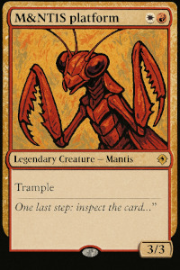

# The Silent Packets - Write-up

This is a write-up for the challenge [The Silent Packets](../The_Silent_Packets/).

> April 2025 – In a sensitive maritime surveillance context, one of our autonomous drones operating offshore experienced a critical security incident.
> 
> This drone was remotely operated via a satellite link and was equipped with an onboard Linux system integrating both OT and IT layers, including a web-based supervision server for operators.
> 
> Log data shows that the drone temporarily:
> - lost its GPS connection,
> - experienced partial communication jamming,
> - and most notably: an unknown kernel module was dynamically loaded.

It is explained in the challenge's description that a kernel module is dynamically loaded.
We can infer that the pcap file contains a communication with the server.

This server receives an HTTP request with the TCP `URG` flag set.
It is a furtivity technique used by attackers to communicate bytes.
Those bytes form a key (up to a terminating NUL byte) which is then used as an argument to load a kernel module (`.ko`).
The module applies transformations (XOR / encryption) and produces a final payload: a JPEG image that contains hidden data.
The final extraction is performed with *steghide* using the author value (hinted by a ROT13 message in the module) as the passphrase.

## Pcap Analysis

### Goal

Identify TCP segments with the `URG` flag and extract the bytes carried by those segments.

The objective here is to retrieve how a key is transfered to the remote
server.
At first, the pcap seems to be a simple benign HTTP exchange.
However, the `URG` flag is a bit odd for such a communication.
This furtivity step is known as TCP Urgent Pointer.
On each packet, an extra byte is added after the checksum which does not interfer with the original HTTP exchange.
The same exchange is splitted in several pacets.
As a result, the reconscruted HTTP request does not show these extra bytes.

### Retrieving the key

```
$ tshark -r output.pcap -Y "tcp.flags.urg == 1" -T fields -e tcp.seq -e tcp.payload[0:1]
1 ba
22 da
42 55
62 c0
82 ff
102 ee
122 00
```

Concatenate payload values without `0x00` (end char) to build the key.
Because the key is understandable and short, it could be visually reconstructed using wireshark too.
The final key exchanged in the pcap is `0xbada55c0ffee`.

## Kernel module analysis

In the `dmesg.txt` file, one can read at the end of the file that the module named `kern_http` is odd.
No verficiation is performed or signature is found.
In addition, the module is loaded last and a print explains that a payload is written to `/tmp/flag`.
This is the file to retrieve.
After inspection either dynamic or static of the kernel module, it appears that the flag is ciphered.
The key was retrieved in step 1.
It is known that the expected file to retrieve is a JPG file as shown in the reverse of the kernel module.
As a result, it is possible to retrieve the IV since the key, the ciphertext and the headers bytes are known (jpeg ones).
Once you have retrieved the IV (which appear to be not initialized, therefore null), use the key `0xbada55c0ffee` with the AES-CBC mode to retrieve the original picture.

## Steganography

The module included a ROT13-encoded note in the module's description field instructing the solver to use the author value as the passphrase for the final step.
Such author is M&NTIS.

<p align="center">
    
</p>

You can extract hidden data with *steghide*:

```
steghide extract -sf candidate.jpg -p "M&NTIS"
```

The extracted file contains the real final flag: `ECW{gg_U_d4s4rv3_a_c00kie_XXXXXXXXXXXXXXXXXX}`.
